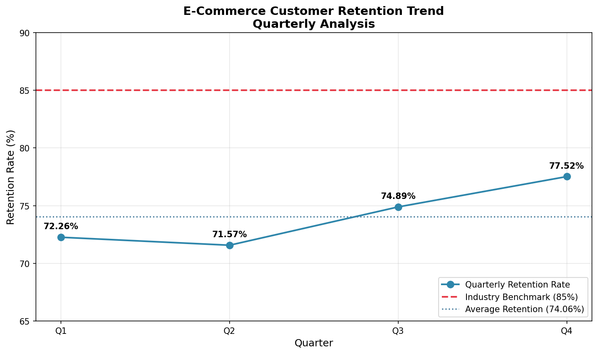

# E-Commerce Customer Retention Analysis: A Data Story

**Author:** 24f2000604@ds.study.iitm.ac.in  
**Email:** 24f2000604@ds.study.iitm.ac.in  
**Contact:** 24f2000604@ds.study.iitm.ac.in

---

## Executive Summary

This analysis examines quarterly customer retention rates for an e-commerce platform, comparing performance against industry benchmarks and providing actionable recommendations to improve customer loyalty.

> **Note:** This analysis was developed using an LLM-powered workflow (ChatGPT Codex / LLM) to generate the analysis code and visualization.

---

## Dataset Description

The dataset consists of quarterly customer retention metrics tracked over a full fiscal year:

| Quarter | Retention Rate (%) |
|---------|-------------------|
| Q1      | 72.26             |
| Q2      | 71.57             |
| Q3      | 74.89             |
| Q4      | 77.52             |

**Data Source:** `data/retention_quarterly.csv`

Customer retention rate measures the percentage of customers who continue to make purchases from the platform after their initial transaction, calculated on a quarterly basis.

---

## Key Findings

### 📊 Average Retention Rate: **74.06%**

The calculated average retention rate across all four quarters is **74.06%**, derived from the following quarterly values:
- Q1: 72.26%
- Q2: 71.57% (lowest)
- Q3: 74.89%
- Q4: 77.52% (highest)

### 📈 Quarterly Trend Analysis



The visualization above shows:
- **Blue line**: Quarterly retention performance
- **Red dashed line**: Industry benchmark target at **85%**
- **Blue dotted line**: Average retention at **74.06%**

**Trend Observations:**
1. **Q1 to Q2**: Slight decline of 0.69 percentage points
2. **Q2 to Q3**: Recovery with 3.32 percentage points improvement
3. **Q3 to Q4**: Continued growth with 2.63 percentage points increase
4. **Overall**: Positive upward trend from Q2 onwards, indicating improving customer loyalty

---

## Business Implications

### Gap Analysis: Current vs. Industry Target

| Metric | Value |
|--------|-------|
| Current Average | 74.06% |
| Industry Target | 85% |
| **Gap** | **10.94 percentage points** |

### Financial Impact

For a typical e-commerce platform, each 1% improvement in customer retention can translate to:
- **5-25% increase in profits** (based on industry research by Bain & Company)
- **Reduced customer acquisition costs** as retained customers require less marketing spend
- **Higher lifetime value (LTV)** through repeat purchases

With an average retention of 74.06% vs. the industry benchmark of 85%, the platform is potentially losing significant revenue from churned customers.

### Trend Significance

The positive trajectory from Q2 (71.57%) to Q4 (77.52%) suggests:
- Recent retention initiatives are working
- There is momentum that can be built upon
- Q4's strong performance (77.52%) shows the potential ceiling is achievable

---

## Actionable Recommendations

### 🎯 Primary Strategy: Implement Targeted Retention Campaigns

To close the **10.94 percentage point gap** and reach the industry target of **85%**, we recommend:

#### 1. **Personalized Re-engagement Campaigns**
   - Deploy email sequences triggered by customer inactivity patterns
   - Use purchase history to recommend relevant products
   - Implement dynamic discounting based on customer segment value

#### 2. **Loyalty Program Enhancement**
   - Introduce tiered rewards to incentivize repeat purchases
   - Offer exclusive early access to sales and new products
   - Create referral bonuses to leverage satisfied customers

#### 3. **Proactive Churn Prevention**
   - Build predictive models to identify at-risk customers before they churn
   - Deploy targeted interventions (special offers, surveys) for high-risk segments
   - Establish customer success outreach for high-value accounts

#### 4. **Customer Experience Optimization**
   - Streamline the checkout process to reduce friction
   - Implement hassle-free returns and exchanges
   - Provide proactive order tracking and delivery updates

#### 5. **Feedback Loop Integration**
   - Send post-purchase satisfaction surveys
   - Act on negative feedback within 24 hours
   - Create closed-loop communication to show customers their input matters

### 📅 Implementation Timeline

| Phase | Actions | Expected Impact |
|-------|---------|-----------------|
| Month 1-2 | Launch loyalty program, email re-engagement | +2-3% retention |
| Month 3-4 | Deploy churn prediction model, targeted interventions | +3-4% retention |
| Month 5-6 | CX optimization, feedback integration | +2-3% retention |

**Projected Outcome:** Achieve **82-85%** retention within 6 months.

---

## Repository Files

### Analysis Files
- `scripts/analysis/retention_analysis.py` - Python script for retention analysis and visualization
- `requirements.txt` - Python dependencies (pandas, matplotlib)

### Data Files
- `data/retention_quarterly.csv` - Quarterly retention data (Q1-Q4)

### Visualizations
- `visuals/retention_trend.png` - Line chart showing retention trend vs. benchmark

### Legacy Supply Chain Analysis
- `correlation.csv` - Correlation matrix values
- `heatmap.png` - Heatmap visualization
- `supply_chain_data.csv` - Raw supply chain dataset
- `correlation_analysis.py` - Supply chain correlation analysis script

---

## How to Run the Analysis

### Prerequisites
```bash
pip install -r requirements.txt
```

### Execute Analysis
```bash
python scripts/analysis/retention_analysis.py
```

This will:
1. Calculate the average retention rate (74.06%)
2. Generate the trend visualization at `visuals/retention_trend.png`
3. Export data to `data/retention_quarterly.csv`

---

## Technical Notes

- **Average Calculation:** (72.26 + 71.57 + 74.89 + 77.52) / 4 = **74.06%**
- **Industry Benchmark Source:** E-commerce industry standard target of 85%
- **Visualization:** Generated using matplotlib with annotations for clarity
- **LLM-Powered Development:** Analysis code was generated using ChatGPT Codex / LLM workflow

---

## Author Information

**Email:** 24f2000604@ds.study.iitm.ac.in

---

*Analysis powered by Python, Pandas & Matplotlib*  
*Developed with LLM-assisted coding (ChatGPT Codex / LLM)*  
*Contact: 24f2000604@ds.study.iitm.ac.in*
